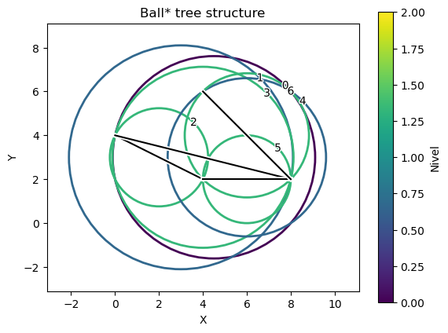
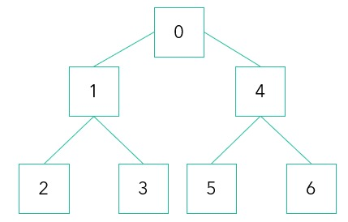

# Adaptación de Ball* Tree para almacenar aristas
La presente estructura de datos presenta una adaptación de Ball* Tree para el almacenamiento de tipo arista.

Inspirado en la implementación de un Ball* Tree para datos tipo puntos desde:  
Dolatshah, M., Hadian, A., & Minaei-Bidgoli, B. (2015). Ball*-tree: Efficient spatial indexing for constrained nearest-neighbor search in metric spaces. arXiv preprint arXiv:1511.00628.

## Definición de la estructura de datos
El Ball* Tree se divide en dos componentes principales: Nodos intermedios (Incluyendo la raíz) y nodos hojas (Para el almacenamiento de las aristas).
### Nodo intermedio
Cada nodo interno del árbol representa una bola que encierra los centroides de las esferas contenidas en el subárbol y también encierra el par de puntos que conforma cada arista.
### Nodo hoja
El nodo hoja contiene una bola que solo encierra el dato arista conformado por un par de puntos. Son las bolas más pequeñas en la estructura.
### Puntos y Aristas
Los puntos estan dados por una posición x e y. Las aristas estan dadas por un par de puntos y un identificador para su busqueda.
### Ejemplo
A continuación se muestra la implementación de un Ball* Tree para un grafo.

 

 

## Compilador Recomendado

La estructura de datos fue desarrollada con el compilador g++ de minGW-w64.

## Algoritmos usados en Ball* Tree

### Algoritmos para inserción

#### PCA para un conjunto de puntos

$$
w(1) = \arg\max \frac{w^T X^T X w}{w^T w}
$$

#### Obtención del hiperplano para dividir puntos

$$
F(tc) = \frac{|N_2 - N_1|}{N} + \alpha \left( \frac{tc - t_{\text{min}}}{t_{\text{max}} - t_{\text{min}}} \right)
$$

### Algoritmos para busqueda de vecino mas cercano

#### Distancia entre punto P y punto Q

$$
\sqrt{(x_q - x_p)^2 + (y_q - y_p)^2}
$$

#### Distancia entre punto P y arista AB

Vectorización
$$
\mathbf{AB} = (B_x - A_x, B_y - A_y)
$$

$$
\mathbf{AP} = (P_x - A_x, P_y - A_y)
$$

Proyección de P a la recta extendida de AB
$$
t = \frac{\mathbf{AP} \cdot \mathbf{AB}}{\mathbf{AB} \cdot \mathbf{AB}}
$$

Clamp t al rango [0, 1]
$$
t = \max(0, \min(1, t))
$$

Calculo de la proyección de P
$$
P_{\text{proj}} = A + t \cdot \mathbf{AB}
$$

$$
P_{\text{proj}} = (A_x + t \cdot (B_x - A_x), A_y + t \cdot (B_y - A_y))
$$

Calculo de la distancia entre P y Pproj

$$
\sqrt{(P_x - P_{\text{proj},x})^2 + (P_y - P_{\text{proj},y})^2}
$$